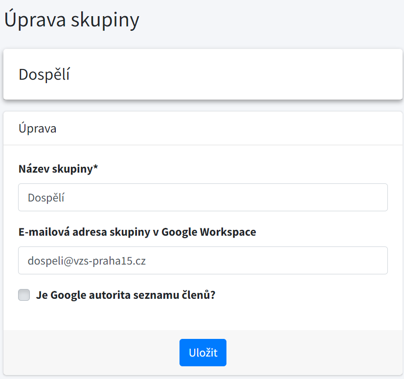

***************************************
Synchronizace skupin s Google Workspace
***************************************

Jednou ze speciálních vlastností systému je schopnost synchronizovat skupiny uživatelů
v našem systému se skupinou v produktu Google Workspace.

Díky této funkcionalitě není nutné udržovat skupiny na dvou místech, a tak nenastane
situace, kdy by se zapomnělo přidat osobu do skupiny v Google Workspace nebo naopak.

V našem systému jsou skupiny především určeny k definování skupiny osob, které se
mohou přihlásit na akce nebo dostávat platby. Skupiny v Google Workspace slouží jako
distribuční skupiny pro zasílání e-mailů, sdílení dokumentů a další.

Nastavení synchronizace
-----------------------

Pro možnost provádění synchronizace je třeba u skupiny nastavit e-mailovou adresu v
rámci nástroje Google Workspace. Dále je možné zvolit, kdo je autoritou v seznamu skupin.

Pokud je náš systém autoritou, při každé synchronizaci budou z Google Workspace skupiny
odebrány všechny osoby, které nejsou přidány do skupiny v našem systému.

V opačném případě, kdy je autoritou Google Workspace, bude při každé synchronizaci
aktualizovaný seznam členů ve skupině v našem systému tak, aby obsahoval pouze osoby s
e-mailovou adresou uvedenou v seznamu členů skupiny v Google Workspace.

Spuštění synchronizace
-----------------------

Funkce synchronizace je implicitně zabudována v systému, a synchronizace proběhne pokaždé,
když dojde k nějaké změně v členství ve skupině.

Synchronizaci skupin je možné provést i manuálně pomocí tlačítka **Synchronizovat s Google**
na stránce s detailem skupiny. Tato stránka je dostupná všem osobám s oprávněním **Správce skupin**.

Zároveň správcům systému doporučujeme pravidelně spouštět synchronizaci, například jednou za den,
pomocí  :ref:`příkazů aplikace <vlastni_django_prikazy>` (další informace lze nalézt v dokumentaci pro vývojáře).

