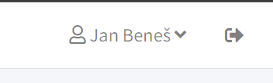

***************************************
Základní informace o ovládání systému
***************************************

Systém je dostupný pouze jako webová aplikace dostupná skrze webový prohlížeč. K aplikaci
neeixstuje žádný klientský program či mobilní aplikace, ale web je uzpůsoben tak,
aby byl snadno použitelný i na mobilních zařízeních.

Přihlašování, uživatelské účty
------------------------------

Pro ovládání systému je třeba mít zřízený uživatelský účet. Bez účtu není možné provádět
žádné operace. Pokud účet zatím nemáte, je možné o něj požádat správce systému.

Pro přihlášení můžete buď využít kombinaci e-mailové adresy a hesla, případně je možné
se přihlásit pomocí účtu Google. V případě přihlášení pomocí Google účtu je třeba mít
v systému zadaný e-mail, který Google účtu odpovídá. Propojení se systémem Google je určené
jen pro účely přihlašování, žádné údaje (kromě jména a e-mailové adresy) se z Vašeho Google účtu nezískávají.

V případě zapomenutého hesla je možné si nechat prostřednictvím tlačítka **Resetovat heslo**
zaslat e-mail s odkazem pro obnovení hesla.

Ovládání více osob
------------------

V systému je možné, aby jedna osoba ovládala uživatelské účty dalších osob. Tyto osoby
k Vašemu profilu přidává správce systému. Tato funkcionalita se vám bude hodit například v
situaci, kdy jste rodič a chtěli byste mít přístup k účtu svého dítěte.

V případě, že máte přidělené další osoby, je možné mezi nimi přepínat pomocí výběrového
seznamu v pravém horním rohu aplikace (vedle tlačítka pro odhlášení).

Pokud jste rodič a chcete přihlásit své dítě například na trénink, je třeba se nejprve
přepnout na jeho profil. Bez přepnutí na profil dítěte vidíte jen operace, které můžete
provádět ze svého profilu osoby.

Úvodní stránka
--------------

Na titulní stránce (v systému nazývané Dashboard) vidíte nejaktuálnější informace o vašem profilu
(nejbližší tréninky, akce, platby před splatností, atd.). Pokud některou z karet s informacemi nevidíte,
pravděpodobně pro vás v dané oblasti nejsou relevantní žádné informace.

Postranní menu
--------------

Aplikace se ovládá pomocí levého postranního menu. V případě, že menu nevidíte, je třeba
jej zobrazit pomocí ikony v levém horním rohu aplikace.

V menu se zobrazují jen ty karty, které jsou pro vás relevantní. V případě, že máte v
systému vyšší oprávnění, vidíte více položek menu.

