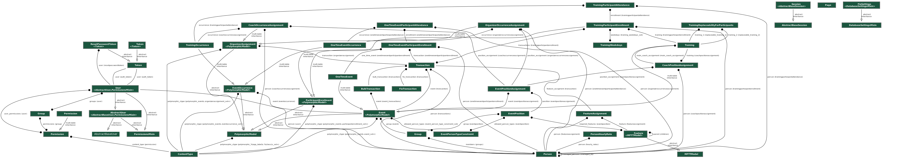

.. _db:

***************************************
Databáze
***************************************
Pro práci s databází se používá Django ORM, které umožňuje komunikovat s relačními databázemi pomocí Pythonu. Místo psaní SQL dotazů se pomocí ORM v Djangu definují modely, což jsou třídy v Pythonu reprezentující tabulky databáze. S databází je možné provádět operace pomocí standardní syntaxe Pythonu.

Databázový model se nenachází na jenom místě, je rozdělen na části. Každá aplikace obsahuje v souboru models.py část modelu, se kterou pracuje. Modely, které pomyslně leží na pomezí dvou aplikací a propojují tak modely do dohromady, se nachází v té aplikaci, která model využívá více.

Pro rámcovou představu celého modelu sem přikládáme obrázek zobrazující závislosti a propojení jednotlivých entit.

.. _migrations:

---------------------
Migrace
---------------------
S modely aplikací úzce souvisí migrace. Pokud aplikace pracuje s modely, obsahuje i adresář ``migrations/``, ve kterém se nachází migrace. Migrace jsou očíslované soubory, které popisují změny databázového schématu.

Pokud v aplikaci upravíme model, musíme spustit příkaz ``python ./manage.py makemigrations``, který vytvoří migrační soubory. Pro aplikaci migrací a změnu databázového schématu musíme spustit ještě příkaz ``python ./manage.py migrate``.

Výhodou tohoto přístupu je, že nám téměř odpadá starost s databázemi, protože Django ORM implementuje ovladače pro generování korektních SQL dotazů pro všechny standardní relační DB systémy.

.. _polymorfni_modely:

---------------------
Polymorfní modely
---------------------
Události, pro které bylo potřeba vytvořit model, mohou být jedním ze dvou možných druhů. Může se jednat o jednorázové události nebo tréninky, které se konají opakovaně. Mezi jednorázovými události a tréninky je však mnoho různých i společných vlastností, některé společné vlastnosti ale mohou obsahovat různé hodnoty v závislosti na druhu události. Z tohoto důvodu nebyly pro událost vytvořeny standardní modely, ale bylo použito rozšíření `django-polymorphic <https://github.com/jazzband/django-polymorphic>`_, které implementuje plně polymorfní modely.
