**************************
Popis Django aplikací
**************************

Tato stránka obsahuje všechny Django aplikace a jejich popis.

.. _api:

--------------------------------------
api
--------------------------------------
Tato aplikace obsahuje implementaci API. 

Model
^^^^^^^^^^^^^^^^^
Model aplikace :ref:`api` rozšiřuje funkčnost modelu Token, který je součástí :ref:`djangorestframework`. Rozšíření spočívá v přidání atributu :py:attr:`~api.models.Token.name` (jméno tokenu).

Mezi další důležité atributy, které jsou obsaženy v rodiči, patří:

- :py:attr:`~api.models.Token.created` (datum a čas vytvoření) 
- :py:attr:`~api.models.Token.key` (API klíč), pokud jeho hodnota není vyplněna, bude při uložení modelu automaticky vygenerována.

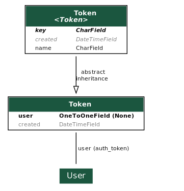

Více informací API, včetně příkladů použití, je možné se dozvědět na zvláštní stránce :doc:`./api`.

.. _events:

--------------------------------------
events
--------------------------------------
Události jsou vždy jedním ze dvou druhů; buďto se jedná o jednorázové události, nebo tréninky. Většina operací prováděná nad událostmi bez ohledu na jejich druh má společný základ, který je implementován právě v aplikaci :ref:`events`. Specifická funkcionalita závislá na druhu události je potom zajištěna pomocí dědičnosti a nachází se v aplikacích :ref:`one_time_events`, nebo :ref:`trainings`.

Součástí aplikace jsou template filtry specifické pro doménu událostí, které se nachází v souboru templatetags/events_template_tags.py. Více o template filtrech je možné se dočíst v části :doc:`./template-filters`.

Formuláře patřící do této aplikace zpravidla implementují pouze společný základ pro jednorázové události a tréninky, konečná implementace využívaného formuláře se nachází v aplikacích :ref:`one_time_events` a :ref:`trainings`.

Mezi pohledy implementované v této aplikaci v souboru views.py patří hlavně pohledy končící textem ``DeleteView``, které dle konvencí Djanga značí pohled, který maže objekt z databáze. Tuto funkcionalitu je možné implementovat na úrovni této aplikace, protože ``generic.DeleteView``, z kterého dědí ``DeleteView`` pohledy této aplikace, používá ke smazání metodu ``delete`` na modelu, která je plně polymorfní díky použití rozšíření :ref:`django-polymorphic`.

Model
^^^^^^^^^^^^^^^^^
Aplikace :ref:`events` obsahuje několik modelů z nichž všechny kromě :py:class:`~events.models.EventPositionAssignment` jsou polymorfní a jsou dále rozšířeny v modelech aplikací :ref:`one_time_events` a :ref:`trainings`.

:py:class:`~events.models.EventPositionAssignment` definuje přiřazení pozice definované v aplikaci :ref:`positions` k události. Model :py:class:`~events.models.EventPositionAssignment` navíc obsahuje atribut :py:attr:`~events.models.EventPositionAssignment.count` (počet osob, který jsou na danou pozici vyžadován).

:py:class:`~events.models.ParticipantEnrollment` definuje přihlášku účastníka, obsahuje:

- :py:attr:`~events.models.ParticipantEnrollment.created_datetime` (datum a čas provedení přihlášky)
- :py:attr:`~events.models.ParticipantEnrollment.state` (stav přihlášky – schválen, náhradník, odmítnut)

:py:class:`~events.models.Event` definuje událost, obsahuje:

- :py:attr:`~events.models.Event.name` (název)
- :py:attr:`~events.models.Event.description` (popisek)
- :py:attr:`~events.models.Event.location` (místo konání)
- :py:attr:`~events.models.Event.date_start` (datum začátku)
- :py:attr:`~events.models.Event.date_end` (datum konce)
- :py:attr:`~events.models.Event.positions` (přiřazené pozice)
- :py:attr:`~events.models.Event.participants_enroll_state` (výchozí stav, který je aplikován na nové účastníky)
- :py:attr:`~events.models.Event.capacity` (maximální počet účastníků)
- :py:attr:`~events.models.Event.min_age` (minimální věk účastníků)
- :py:attr:`~events.models.Event.max_age` (maximální věk účastníků)
- :py:attr:`~events.models.Event.group` (skupina, ve které musí být účastníci členem)
- :py:attr:`~events.models.Event.allowed_person_types` (typ členství, které je vyžadováno u účastníků)

:py:class:`~events.models.EventOccurrence` definuje jedno konání události, obsahuje:

- :py:attr:`~events.models.EventOccurrence.event` (událost)
- :py:attr:`~events.models.EventOccurrence.state` (stav události – neuzavřena, uzavřena, zpracována)

:py:class:`~events.models.OrganizerAssignment` definuje přiřazení organizátora ke dni konání události, obsahuje pouze:

- :py:attr:`~events.models.OrganizerAssignment.transaction` (transakce k proplacení za organizaci)

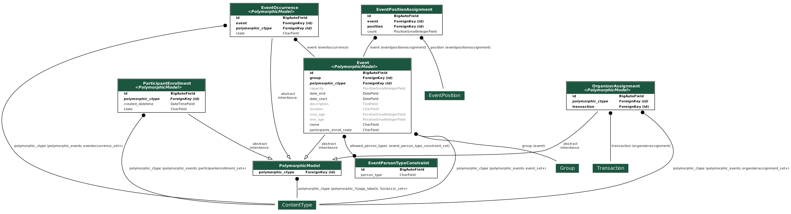

.. _features:

--------------------------------------
features
--------------------------------------
Vlastnosti jsou jedním ze tří druhů. Vždy se jedná o kvalifikaci, oprávnění, nebo vybavení, ty se přiřazují osobám a definují tak kompetence osoby (např. možnost přihlášení na konkrétní pozici). Některé vlastnosti mohou být časově omezené. U vybavení se eviduje datum vrácení, protože Organizace vybavení půjčuje.

Tato aplikace definuje vlastnosti a poskytuje pohledy, formuláře a další nástroje pro jejich správu, včetně možnosti přiřazení vlastnosti ke konkrétní osobě.

Model
^^^^^^^^^^^^^^^^^
Aplikace features obsahuje dva modely, konkrétně se jedná o :py:class:`~features.models.Feature` (vlastnost) a :py:class:`~features.models.FeatureAssignment` (přiřazení vlastnosti k osobě). Model :py:class:`~features.models.Feature` využívá rozšíření :ref:`django-mptt`. Vlastnosti je možné uložit jako stromová data a je možné definovat, zda je vlastnost přiřaditelná k osobě (zpravidla chceme zakázat pro uzly, které nejsou listy).

:py:class:`~features.models.Feature`

- :py:attr:`~features.models.Feature.feature_type` (druh vlastnosti – kvalifikace, oprávnění, vybavení)
- :py:attr:`~features.models.Feature.name` (název vlastnosti)
- :py:attr:`~features.models.Feature.assignable` (flag, indikující, zda je vlastnost přiřaditelná)
- :py:attr:`~features.models.Feature.never_expires` (flag, indikující, zda vlastnost nikdy neexpiruje)
- :py:attr:`~features.models.Feature.fee` (poplatek za vlastnost, využíván jako poplatek za půjčení vybavení)
- :py:attr:`~features.models.Feature.tier` (úroveň vlastnosti, využíváno u kvalifikací)
- :py:attr:`~features.models.Feature.collect_issuers` (flag, indikující, zda při přiřazení vlastnosti k osobě bude vyžadováno vyplnění vydavatele)
- :py:attr:`~features.models.Feature.collect_codes` (flag, indikující, zda při přiřazení vlastnosti k osobě bude vyžadováno vyplnění ID vlastnosti)

:py:class:`~features.models.FeatureAssignment`

- :py:attr:`~features.models.FeatureAssignment.person` (osoba, ke které se vlastnost přiřazuje)
- :py:attr:`~features.models.FeatureAssignment.feature` (vlastnost, která se k osobě přiřazuje)
- :py:attr:`~features.models.FeatureAssignment.date_assigned` (datum přiřazení)
- :py:attr:`~features.models.FeatureAssignment.date_expire` (datum expirace)
- :py:attr:`~features.models.FeatureAssignment.date_returned` (datum vrácení – pouze pro vybavení)
- :py:attr:`~features.models.FeatureAssignment.issuer` (vydavatel vlastnosti)
- :py:attr:`~features.models.FeatureAssignment.code` (ID vlastnosti)
- :py:attr:`~features.models.FeatureAssignment.expiry_email_sent` (flag, indikující, zda byl osobě odeslán notifikační e-mail oznamující expiraci)

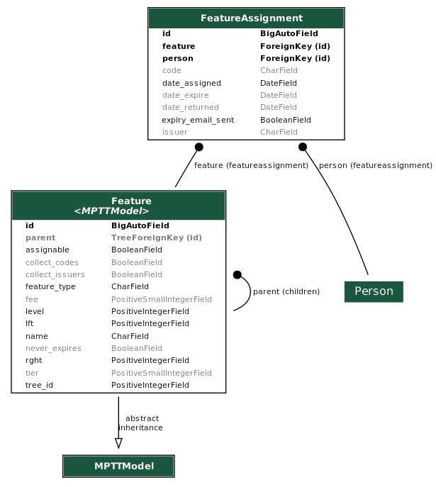

.. _groups:

--------------------------------------
groups
--------------------------------------
Aplikace groups definuje skupiny, ve kterých se sdružují osoby. Součástí aplikace je několik pohledů, šablon a formulářů pro správu skupin.

Každá skupina má definováno zda využívá synchronizaci s odpovídající skupinou v Google Workspace (tj. zda je emailová adresa této skupiny vyplněna v atributu :py:attr:`~groups.models.Group.google_email`). Pokud je synchronizace povolena, tak změna členství na jedné straně se promítne do skupiny na druhé straně, případné konflikty se vyřeší dle nastavení atributu :py:attr:`~groups.models.Group.google_as_members_authority`.

Členství ve skupině může být použito jako jedno z kritérii určující oprávnění k přihlášení na pozici jako organizátor nebo jako účastník události.

Model
^^^^^^^^^^^^^^^^^
Mezi atributy definované modelem patří:

- :py:attr:`~groups.models.Group.name` (jméno)
- :py:attr:`~groups.models.Group.google_email` (emailová adresa skupiny uvnitř Google Workspace)
- :py:attr:`~groups.models.Group.google_as_members_authority` (flag, indikující, zda Google skupina s emailovou adresou :py:attr:`~groups.models.Group.google_email` je autoritou při synchronizaci osob)
- :py:attr:`~groups.models.Group.members` (seznam členů skupiny)

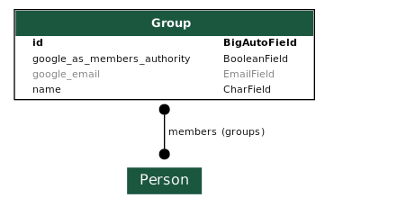

.. _one_time_events:

--------------------------------------
one_time_events
--------------------------------------
Aplikace :ref:`one_time_events` obsahuje implementaci jednorázových událostí. Nachází se zde veškerá implementace zahrnující pohledy, formuláře, pomocné funkce atd. Součástí aplikace je i několik druhů pohledů určených pro různé úrovně oprávnění. 

Implementace transakcí týkajících se jednorázových událostí se nachází výhradně v aplikaci :ref:`transactions`.

Model
^^^^^^^^^^^^^^^^^
Vzhledem k tomu, že aplikace implementuje klíčovou funkcionalitu :term:`IS`, je model poměrně rozsáhlý. 

Aplikace obsahuje modely: 

- :py:class:`~one_time_events.models.OneTimeEvent` (jednorázová událost)
- :py:class:`~one_time_events.models.OrganizerOccurrenceAssignment` (přiřazení organizátora na pozici události k určitému dni)
- :py:class:`~one_time_events.models.OneTimeEventParticipantAttendance` (docházka účastníka události k určitému dni)
- :py:class:`~one_time_events.models.OneTimeEventOccurrence` (den události)
- :py:class:`~one_time_events.models.OneTimeEventParticipantEnrollment` (přihláška účastníka události)

Všechny modely vyjma :py:class:`~one_time_events.models.OneTimeEventParticipantAttendance` dědí z rodiče, který je polymorfním modelem.

:py:class:`~one_time_events.models.OneTimeEvent` dědí z :py:class:`~events.models.Event`

- :py:attr:`~one_time_events.models.OneTimeEvent.enrolled_participants` (přihlášení účastníci)
- :py:attr:`~one_time_events.models.OneTimeEvent.default_participation_fee` (výchozí výše poplatku pro účastníky)
- :py:attr:`~one_time_events.models.OneTimeEvent.category` (druh události – komerční, kurz, prezentační, pro děti, společenská)
- :py:attr:`~one_time_events.models.OneTimeEvent.training_category` (druh tréninku, na kterém musí být účastník této události schváleným účastníkem)
- :py:attr:`~one_time_events.models.OneTimeEvent.state` (stav události – nezavřena, uzavřena, zpracována)
- další atributy z :py:class:`~events.models.Event`

:py:class:`~one_time_events.models.OrganizerOccurrenceAssignment` dědí z :py:class:`~events.models.OrganizerAssignment`

- :py:attr:`~one_time_events.models.OrganizerOccurrenceAssignment.position_assignment` (pozice přiřazená k události)
- :py:attr:`~one_time_events.models.OrganizerOccurrenceAssignment.person` (osoba)
- :py:attr:`~one_time_events.models.OrganizerOccurrenceAssignment.occurrence` (den události)
- :py:attr:`~one_time_events.models.OrganizerOccurrenceAssignment.state` (stav dne události – nezavřen, uzavřen, zpracován)
- další atributy z :py:class:`~events.models.OrganizerAssignment`

:py:class:`~one_time_events.models.OneTimeEventParticipantAttendance`

- :py:attr:`~one_time_events.models.OneTimeEventParticipantAttendance.enrollment` (přihláška účastníka na událost)
- :py:attr:`~one_time_events.models.OneTimeEventParticipantAttendance.person` (osoba)
- :py:attr:`~one_time_events.models.OneTimeEventParticipantAttendance.occurrence` (den události)
- :py:attr:`~one_time_events.models.OneTimeEventParticipantAttendance.state` (stav docházky – prezence, absence)

:py:class:`~one_time_events.models.OneTimeEventOccurrence` dědí z :py:class:`~events.models.EventOccurrence`

- :py:attr:`~one_time_events.models.OneTimeEventOccurrence.organizers` (osoby, které jsou organizátory dne)
- :py:attr:`~one_time_events.models.OneTimeEventOccurrence.participants` (účastníci dne včetně docházky)
- :py:attr:`~one_time_events.models.OneTimeEventOccurrence.date` (datum konání dne události)
- :py:attr:`~one_time_events.models.OneTimeEventOccurrence.hours` (počet hodin konání)
- další atributy z :py:class:`~events.models.EventOccurrence`

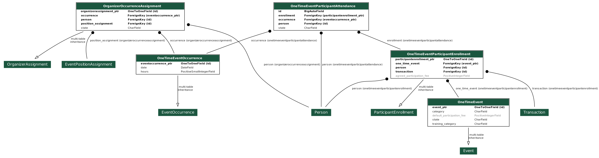

.. _pages:

--------------------------------------
pages
--------------------------------------
Aplikace pages definuje statické stránky, které je možné prohlížet a editovat.

Model
^^^^^^^^^^^^^^^^^
Model je určen k ukládání statických stránek. Každá stránka obsahuje:

- :py:attr:`~pages.models.Page.title` (název)
- :py:attr:`~pages.models.Page.content` (obsah ve formátu HTML)
- :py:attr:`~pages.models.Page.slug` (URL slug) 
- :py:attr:`~pages.models.Page.last_update` (datum a čas poslední aktualizace)

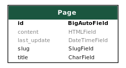

.. _persons:

--------------------------------------
persons
--------------------------------------
Aplikace :ref:`persons` obsahuje implementaci správy členské základny. Konkrétně se jedná o formuláře, pohledy a nástroje pro správu osob, kteří mají nějaký vztah k :term:`Organizaci <Organizace>`.

Model
^^^^^^^^^^^^^^^^^
Aplikace :ref:`persons` obsahuje dva modely a jeden vlastní Django Manager pro model :py:class:`~persons.models.Person`.

:py:class:`~persons.models.PersonsManager` (vlastní manager pro model :py:class:`~persons.models.Person`)

- :py:meth:`~persons.models.PersonsManager.get_queryset` (vrátí seznam všech osob vyjma osob smazaných)
- :py:meth:`~persons.models.PersonsManager.with_age` (přidá osobě políčko ``age`` obsahující vypočtený věk z data narození a aktuálního času)

:py:class:`~persons.models.Person` (Osoba)

- :py:attr:`~persons.models.Person.objects` (instance :py:class:`~persons.models.PersonsManager`)
- :py:attr:`~persons.models.Person.email` (email)
- :py:attr:`~persons.models.Person.first_name` (jméno)
- :py:attr:`~persons.models.Person.last_name` (příjmení)
- :py:attr:`~persons.models.Person.date_of_birth` (datum narození)
- :py:attr:`~persons.models.Person.sex` (pohlaví)
- :py:attr:`~persons.models.Person.person_type` (typ členství)
- :py:attr:`~persons.models.Person.birth_number` (rodné číslo)
- :py:attr:`~persons.models.Person.health_insurance_company` (zdravotní pojišťovna)
- :py:attr:`~persons.models.Person.phone` (tel. číslo)
- :py:attr:`~persons.models.Person.street` (ulice)
- :py:attr:`~persons.models.Person.city` (město)
- :py:attr:`~persons.models.Person.postcode` (PSČ)
- :py:attr:`~persons.models.Person.swimming_time` (čas nutný k uplavání 100m)
- :py:attr:`~persons.models.Person.features` (přiřazené vlastnosti)
- :py:attr:`~persons.models.Person.managed_persons` (spravované osoby)
- :py:attr:`~persons.models.Person.is_deleted` (flag, indikující, zda je osoba smazána)

:py:class:`~persons.models.PersonHourlyRate` (Sazby definující základní plat osoby za jednu hodinu organizátorské práce)

- :py:attr:`~persons.models.PersonHourlyRate.person` (osoba)
- :py:attr:`~persons.models.PersonHourlyRate.event_type` (typ události)
- :py:attr:`~persons.models.PersonHourlyRate.hourly_rate` (sazba za jednu hodinu)
- :py:meth:`~persons.models.PersonHourlyRate.get_person_hourly_rates` (vrátí seznam všech sazeb pro konkrétní osoby)

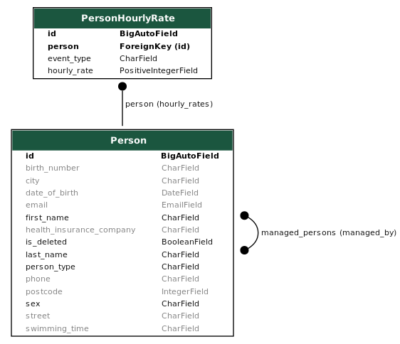

.. _positions:

--------------------------------------
positions
--------------------------------------
Aplikace positions definuje pozice, které jsou přiřazeny k jednorázovým událostem a tréninkům pomocí :py:class:`~events.models.EventPositionAssignment`, to navíc specifikuje další atributy jako např. počet lidí, kteří jsou na pozici vyžadováni. Součástí aplikace je několik pohledů, šablon a formulářů pro správu pozic.

Model
^^^^^^^^^^^^^^^^^
Model aplikace :ref:`positions` definuje atributy pozic mezi které patří: 

- :py:attr:`~positions.models.EventPosition.name` (název)
- :py:attr:`~positions.models.EventPosition.wage_hour` (hodinový příplatek za pozici)
- :py:attr:`~positions.models.EventPosition.required_features` (požadované kvalifikace/oprávnění/vybavení)
- :py:attr:`~positions.models.EventPosition.min_age`, :py:attr:`~positions.models.EventPosition.max_age` (věkové omezení)
- :py:attr:`~positions.models.EventPosition.group` (skupina, v níž je vyžadováno členství)
- :py:attr:`~positions.models.EventPosition.allowed_person_types` (omezení na typ členství)

Model také poskytuje také několik metod, které usnadní práci s modelem. Významnou metodou je :py:meth:`~positions.models.EventPosition.does_person_satisfy_requirements`, která ověřuje, zda osoba splňuje požadavky na pozici k určitému datu.

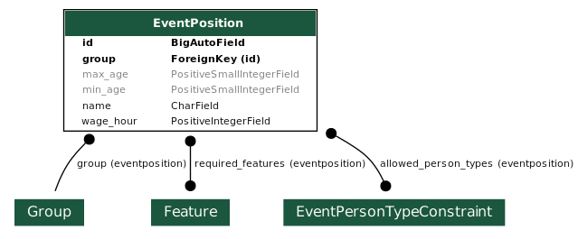

.. _trainings:

--------------------------------------
trainings
--------------------------------------
Aplikace :ref:`trainings` zahrnuje implementaci tréninků. Nachází se zde veškerá implementace obsahující pohledy, formuláře, pomocné funkce atd. Součástí aplikace je i několik druhů pohledů určených pro různé úrovně oprávnění. 

Implementace transakcí týkajících se tréninků se nachází výhradně v aplikaci :ref:`transactions`.

Model
^^^^^^^^^^^^^^^^^
Vzhledem k tomu, že aplikace implementuje klíčovou funkcionalitu :term:`IS`, je model poměrně rozsáhlý. 

Aplikace obsahuje modely:

- :py:class:`~trainings.models.TrainingReplaceabilityForParticipants` (povolené náhrady tréninků)
- :py:class:`~trainings.models.Training` (trénink)
- :py:class:`~trainings.models.CoachPositionAssignment` (přiřazení trenéra k tréninkům)
- :py:class:`~trainings.models.CoachOccurrenceAssignment` (přiřazení trenéra ke dni konání tréninku)
- :py:class:`~trainings.models.TrainingOccurrence` (den konání tréninku)
- :py:class:`~trainings.models.TrainingParticipantAttendance` (docházka účastníka na konkrétním dni tréninku)
- :py:class:`~trainings.models.TrainingParticipantEnrollment` (přihláška účastníka na trénink)
- :py:class:`~trainings.models.TrainingWeekdays` (dny v týdnu, kdy účastník řádně dochází na trénink)

Konkrétně modely :py:class:`~trainings.models.Training`, :py:class:`~trainings.models.CoachOccurrenceAssignment`, :py:class:`~trainings.models.TrainingOccurrence` a :py:class:`~trainings.models.TrainingParticipantEnrollment` dědí z rodiče, který je polymorfním modelem. Ostatní modely nejsou polymorfní, ale specifické pouze pro tréninky.

:py:class:`~trainings.models.TrainingReplaceabilityForParticipants`

- :py:attr:`~trainings.models.TrainingReplaceabilityForParticipants.training_1` (první trénink pro vztah náhrady)
- :py:attr:`~trainings.models.TrainingReplaceabilityForParticipants.training_2` (druhý trénink pro vztah náhrady)

:py:class:`~trainings.models.Training` dědí z :py:class:`~events.models.Event`

- :py:attr:`~trainings.models.Training.enrolled_participants` (přihlášení účastníci)
- :py:attr:`~trainings.models.Training.coaches` (určení řádní trenéři)
- :py:attr:`~trainings.models.Training.main_coach_assignment` (garantující trenér)
- :py:attr:`~trainings.models.Training.category` (druh tréninku – lezecký, plavecký, zdravověda)
- :py:attr:`~trainings.models.Training.po_from` (čas začátku tréninku v pondělí)
- :py:attr:`~trainings.models.Training.po_to` (čas konce tréninku v pondělí)
- :py:attr:`~trainings.models.Training.ut_from` (čas začátku tréninku v úterý)
- :py:attr:`~trainings.models.Training.ut_to` (čas konce tréninku v úterý)
- :py:attr:`~trainings.models.Training.st_from` (čas začátku tréninku ve středu)
- :py:attr:`~trainings.models.Training.st_to` (čas konce tréninku ve středu)
- :py:attr:`~trainings.models.Training.ct_from` (čas začátku tréninku ve čtvrtek)
- :py:attr:`~trainings.models.Training.ct_to` (čas konce tréninku ve čtvrtek)
- :py:attr:`~trainings.models.Training.pa_from` (čas začátku tréninku v pátek)
- :py:attr:`~trainings.models.Training.pa_to` (čas konce tréninku v pátek)
- :py:attr:`~trainings.models.Training.so_from` (čas začátku tréninku v sobotu)
- :py:attr:`~trainings.models.Training.so_to` (čas konce tréninku v sobotu)
- :py:attr:`~trainings.models.Training.ne_from` (čas začátku tréninku v neděli)
- :py:attr:`~trainings.models.Training.ne_to` (čas konce tréninku v neděli)
- další atributy z :py:class:`~events.models.Event`

:py:class:`~trainings.models.CoachPositionAssignment`

- :py:attr:`~trainings.models.CoachPositionAssignment.person` (osoba)
- :py:attr:`~trainings.models.CoachPositionAssignment.training` (trénink)
- :py:attr:`~trainings.models.CoachPositionAssignment.position_assignment` (pozice přiřazená ke tréninku)

:py:class:`~trainings.models.CoachOccurrenceAssignment` dědí z :py:class:`~events.models.OrganizerAssignment`

- :py:attr:`~trainings.models.CoachOccurrenceAssignment.position_assignment` (pozice přiřazená ke tréninku)
- :py:attr:`~trainings.models.CoachOccurrenceAssignment.person` (osoba)
- :py:attr:`~trainings.models.CoachOccurrenceAssignment.occurrence` (den události)
- :py:attr:`~trainings.models.CoachOccurrenceAssignment.state` (stav docházky – prezence, omluven(a), neomluvena(a))
- další atributy z :py:class:`~events.models.OrganizerAssignment`

:py:class:`~trainings.models.TrainingOccurrence` dědí z :py:class:`~events.models.EventOccurrence`

- :py:attr:`~trainings.models.TrainingOccurrence.datetime_start` (datum a čas začátku tréninku konkrétního dne)
- :py:attr:`~trainings.models.TrainingOccurrence.datetime_end` (datum a čas konce tréninku konkrétního dne)
- :py:attr:`~trainings.models.TrainingOccurrence.coaches` (trenéři včetně docházky)
- :py:attr:`~trainings.models.TrainingOccurrence.participants` (účastníci včetně docházky)
- další atributy z :py:class:`~events.models.EventOccurrence`

:py:class:`~trainings.models.TrainingParticipantAttendance`

- :py:attr:`~trainings.models.TrainingParticipantAttendance.enrollment` (přihláška účastníka na událost)
- :py:attr:`~trainings.models.TrainingParticipantAttendance.person` (osoba)
- :py:attr:`~trainings.models.TrainingParticipantAttendance.occurrence` (konkrétní den tréninku)
- :py:attr:`~trainings.models.TrainingParticipantAttendance.state` (stav docházky – prezence, omluven(a), neomluvena(a))

:py:class:`~trainings.models.TrainingParticipantEnrollment` dědí z :py:class:`~events.models.ParticipantEnrollment`

- :py:attr:`~trainings.models.TrainingParticipantEnrollment.training` (trénink)
- :py:attr:`~trainings.models.TrainingParticipantEnrollment.person` (osoba)
- :py:attr:`~trainings.models.TrainingParticipantEnrollment.weekdays` (dny v týdnu, kdy se osoba řádně účastní tréninku)
- :py:attr:`~trainings.models.TrainingParticipantEnrollment.transactions` (transakce za účast)
- další atributy z :py:class:`~events.models.ParticipantEnrollment`

:py:class:`~trainings.models.TrainingWeekdays` (dny v týdnu, kdy účastník řádně dochází na trénink)

- :py:attr:`~trainings.models.TrainingWeekdays.weekday` (index dne v týdnu)

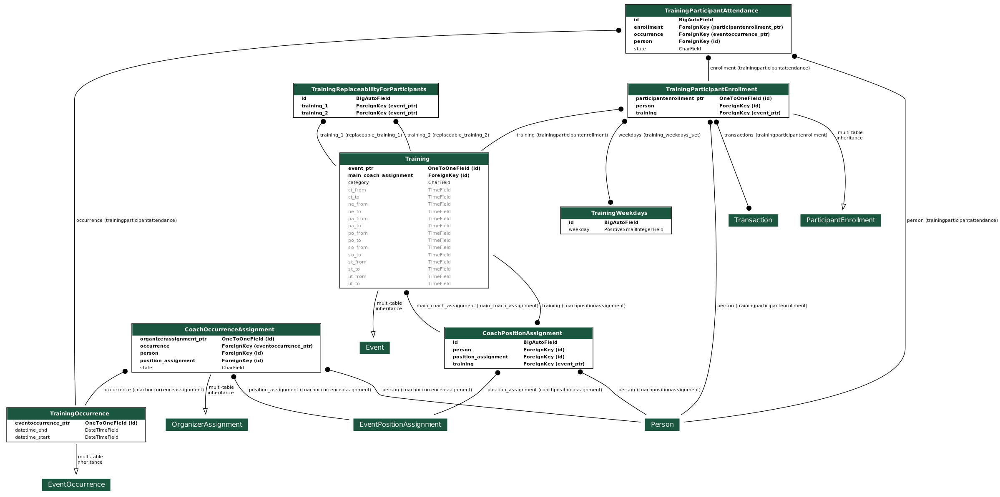

.. _transactions:

--------------------------------------
transactions
--------------------------------------
Transakce definují platební styk mezi :term:`Organizací <Organizace>` a osobu evidovanou v :term:`IS`. Druh transakce se určuje z pohledu osob, jedná se vždy buďto o dluh nebo odměnu. Dluh je částka, kterou osoba má zaplatit Organizaci a odměna je částka, kterou má osoba od :term:`Organizace` obdržet.

IS umožňuje ruční vytváření a editaci transakcí, zpravidla jsou však transakce vytvářeny automaticky jako součást jiné práce s :term:`IS`, např. schválení přihlášky vytvoří transakci typu dluh, zapsání prezence organizátora vytvoří transakci typu odměna. 

Logika týkající se transakcí se často nachází na pomezí aplikací, např. vytvoření transakce schválením přihlášky události. Abychom předešli rozptýlení kódu po celém Django projektu, bylo určena, že veškerá logika, která se týká transakcí, je striktně umístěna v této aplikaci, pro účely lepší přehlednosti.

:term:`Organizace` má účet vedený u Fio banky, která nabízí svým klientům API, `odkaz <https://www.fio.cz/docs/cz/API_Bankovnictvi.pdf>`_. Pro Python existuje implementace v balíčku :ref:`fiobank`, která je závislostí :term:`IS`. Toto API je zejména využíváno pro kontrolu příchozích plateb a synchronizaci stavu transakcí uvnitř :term:`IS` vůči skutečném stavu na bankovním účtu.

Model
^^^^^^^^^^^^^^^^^

Aplikace :ref:`transactions` obsahuje několik modelů, konkrétně se jedná o: :py:class:`~transactions.models.BulkTransaction` (skupinu transakcí, které byly vytvořeny v jedné dávce), :py:class:`~transactions.models.Transaction` (transakci), :py:class:`~transactions.models.FioTransaction` (reprezentace transakce z Fio API), :py:class:`~transactions.models.FioSettings` (singleton model ukládající informace vztažené k Fio)

:py:class:`~transactions.models.BulkTransaction`

- :py:attr:`~transactions.models.BulkTransaction.reason` (důvod všech transakcí z jedné dávky)
- :py:attr:`~transactions.models.BulkTransaction.event` (událost vůči které jsou transakce vztaženy)

:py:class:`~transactions.models.Transaction`

- primární klíč slouží jako variabilní symbol
- :py:attr:`~transactions.models.Transaction.amount` (částka)
- :py:attr:`~transactions.models.Transaction.reason` (důvod)
- :py:attr:`~transactions.models.Transaction.date_due` (datum splatnosti)
- :py:attr:`~transactions.models.Transaction.person` (osoba vůči které je transakce vztažena)
- :py:attr:`~transactions.models.Transaction.event` (událost vůči které je transakce vztažena)
- :py:attr:`~transactions.models.Transaction.feature_assignment` (vlastnost, vůči které je transakce vztažena)
- :py:attr:`~transactions.models.Transaction.bulk_transaction` (hromadná transakce, tato transakce je její součástí)
- :py:attr:`~transactions.models.Transaction.fio_transaction` (Fio transakce odpovídající transakci uvnitř :term:`IS`)

:py:class:`~transactions.models.FioTransaction`

- :py:attr:`~transactions.models.FioTransaction.date_settled` (datum urovnání transakce – zaplacení, či obdržení)
- :py:attr:`~transactions.models.FioTransaction.fio_id` (ID transakce z Fio API)

:py:class:`~transactions.models.FioSettings`

- :py:attr:`~transactions.models.FioSettings.last_fio_fetch_time` (datum a čas poslední synchronizace transakcí s Fio API)

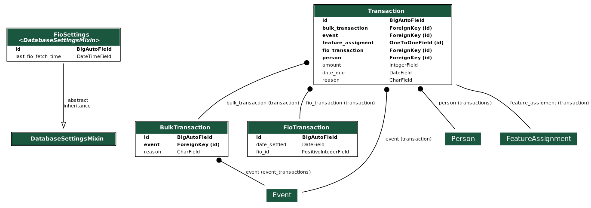

.. _users:

--------------------------------------
users
--------------------------------------
Tato aplikace obsahuje implementaci uživatelských účtů. Každá osoba evidovaná v :term:`IS` má právě jeden uživatelský účet, který ji může být zpřístupněn. Účet je zpřístupněn, pokud má nastavené heslo a je možné se k němu přihlásit. Osoba se pomocí svého uživatelského účtu může do :term:`IS` přihlásit (více viz :doc:`./authentication`) a následně dle svého oprávnění vidí, může pracovat a spravovat relevantní záležitosti (více viz :doc:`./authorization`). Osoba může spravovat více uživatelských účtů (např. rodič dítěte).

Model
^^^^^^^^^^^^^^^^^
Aplikace :ref:`users` obsahuje tři modely a vlastní Django Manager pro model :py:class:`~users.models.User`.

:py:class:`~users.models.UserManager` (vlastní manager pro model :py:class:`~users.models.User`)

- :py:meth:`~users.models.UserManager.create_user` (vytvoří uživatele osoby s daným heslem)
- :py:meth:`~users.models.UserManager.create_superuser` (vytvoří osobu a uživatele se všemi povoleními dle parametrů)

:py:class:`~users.models.User` (model uživatele)

- :py:attr:`~users.models.User.objects` (instance :py:class:`~users.models.UserManager`)
- :py:attr:`~users.models.User.person` (osoba uživatele)
- další atributy z modelu ``AbstractUser``

:py:class:`~users.models.Permission` (vlastní model pro povolení)

- :py:attr:`~users.models.Permission.description` (popis povolení)
- další atributy z modelu ``BasePermission``

:py:class:`~users.models.ResetPasswordToken` (model obsahující tokeny pro reset hesla)

- :py:attr:`~users.models.ResetPasswordToken.user` (uživatel, ke kterému je token přiřazen)
- další atributy z modelu ``BaseToken``
- :py:meth:`~users.models.ResetPasswordToken.has_expired` (vrátí Q objekt pro filtrování expirovaných tokenů)

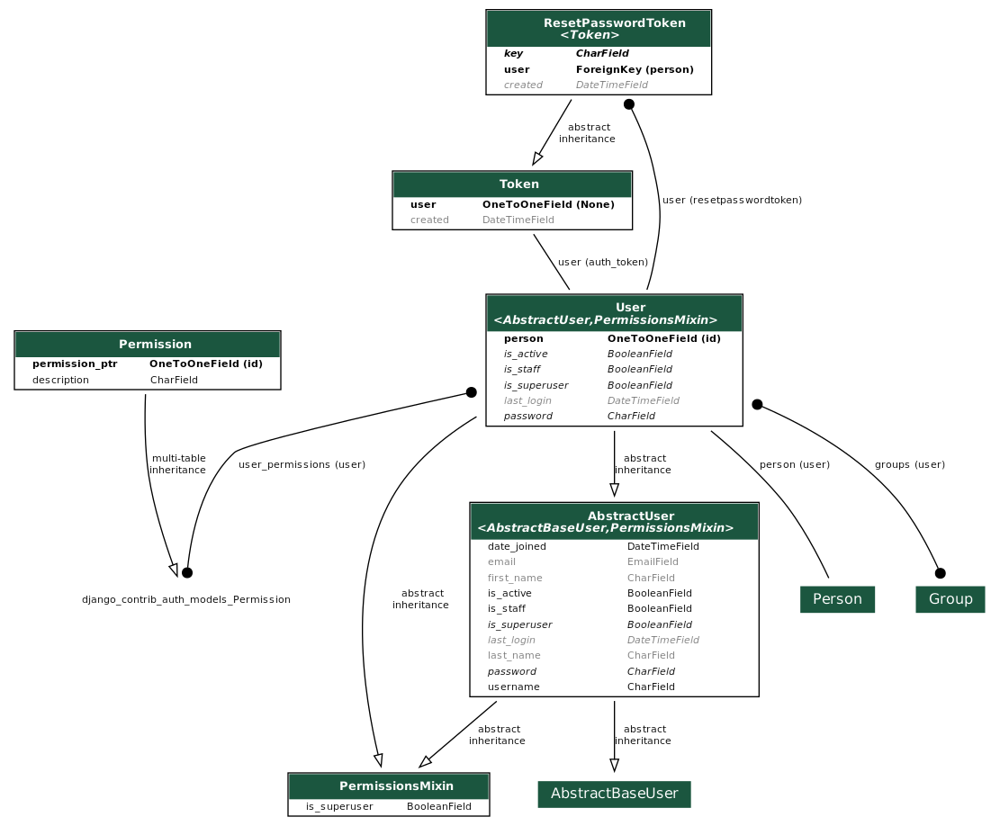

.. _vzs:

--------------------------------------
vzs
--------------------------------------
Aplikace :ref:`vzs` má speciální postavení, jedná se o první a tudíž výchozí aplikaci celého projektu. Její součástí není konkrétní specifická funkcionalita, tato aplikace pouze sdružuje nezařaditelný společný kód, různé pomocné funkce a nachází se zde konfigurace celého projektu.

Aplikace nevyužívá konkrétní model, v souboru ``models.py`` se nachází pouze několik obecných ``Mixin`` tříd, např. :py:class:`~vzs.models.ExportableCSVMixin`, které je možné použít na libovolný model a zajistit tak funkci exportu do formátu CSV.
